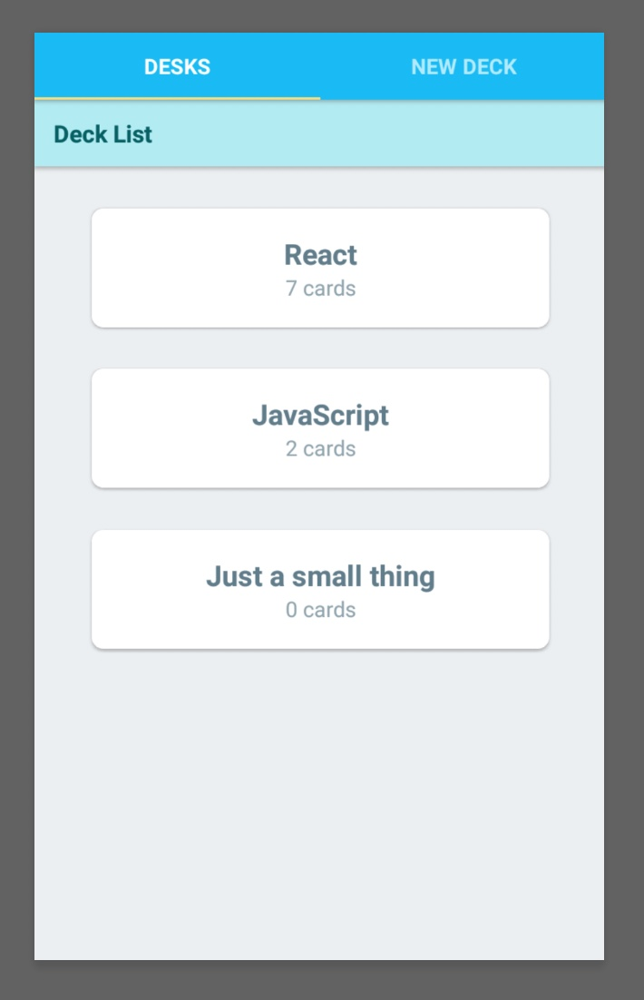

# Mobile FlashCard App

This app will help users to study collections of flashcards. It is possible for users to create different categories of flashcards called "decks", which can hold an unlimited number of cards, then take quizzes on those decks.

## Installation

You can install the app in 2 steps:

```
yarn install
yarn start
```

## Screen shot

 